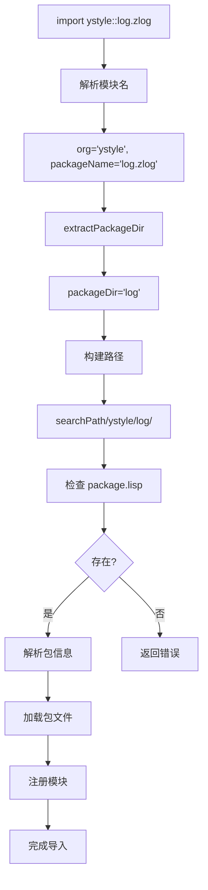

# 模块系统修改可视化说明

## 路径映射对比

### 导入语句
```lisp
(import ystyle::log.zlog)
```

### 当前实现（错误）
```
ystyle::log.zlog
    ↓
parseModuleName()
    ↓
org = "ystyle"
packageName = "log.zlog"
    ↓
❌ Path(searchPath).join("ystyle").join("log.zlog")
    ↓
~/.xisp/modules/ystyle/log.zlog/package.lisp
```

### 文档规范（正确）
```
ystyle::log.zlog
    ↓
parseModuleName()
    ↓
org = "ystyle"
packageName = "log.zlog"
    ↓
extractPackageDir()  ← 新增
    ↓
packageDir = "log"  ← 只取第一级
    ↓
✅ Path(searchPath).join("ystyle").join("log")
    ↓
~/.xisp/modules/ystyle/log/package.lisp
```

---

## 目录结构对比

### 错误结构（当前实现）
```
~/.xisp/modules/
└── ystyle/
    └── log.zlog/              ← ❌ 完整包名
        ├── package.lisp
        ├── core.lisp
        └── zlog/              ← 子模块成为子目录
            ├── core.lisp
            └── file.lisp
```

**问题**：
1. 目录名是 `log.zlog`（包含点号）
2. 子模块 `zlog` 成为子目录，路径混乱

### 正确结构（文档规范）
```
~/.xisp/modules/
└── ystyle/
    └── log/                   ← ✅ 只用第一级
        ├── package.lisp
        ├── core.lisp
        └── zlog/              ← 子目录（可选）
            ├── core.lisp
            └── file.lisp
```

**优势**：
1. 目录名简洁（`log`）
2. 子目录 `zlog/` 用于组织代码文件
3. package.lisp 中声明包名为 `log.zlog`

---

## 包名与目录映射表

### 导入语句 → 目录路径

| 导入语句 | 组织名 | 包名 | 目录名 | 完整路径 |
|---------|-------|------|-------|---------|
| `(import ystyle::log.zlog)` | ystyle | log.zlog | **log** | ~/.xisp/modules/ystyle/log/ |
| `(import std.io.file)` | std | io.file | **io** | ~/.xisp/modules/std/io/ |
| `(import myorg::utils)` | myorg | utils | **utils** | ~/.xisp/modules/myorg/utils/ |
| `(import io)` | (空) | io | **io** | ~/.xisp/modules/io/ |
| `(import org::utils.string.parser)` | org | utils.string.parser | **utils** | ~/.xisp/modules/org/utils/ |

### 关键规则
1. **目录名** = 包名的第一级（`.` 分隔的第一部分）
2. **包名** = 完整层级（如 `log.zlog`）
3. **使用时** = 包名的最后一级（如 `zlog`）

---

## package.lisp 内容

### 文件：~/.xisp/modules/ystyle/log/package.lisp

```lisp
(package log.zlog
  (version "0.2.0")
  (organization "ystyle")
  (description "Logging library"))

;; 可选：在这里声明导出
(export init write shutdown)
```

### 字段说明
- **包名**：`log.zlog`（完整层级）
- **organization**：`ystyle`（组织名，不含在包名中）
- **导入时组合**：`ystyle::log.zlog`

---

## 代码流程图

### 导入流程



### 关键函数调用链

```
evalImport()
  ↓
loadModule("ystyle::log.zlog")
  ↓
resolveModulePath("ystyle::log.zlog")
  ↓
parseModuleName() → ("ystyle", "log.zlog")
  ↓
extractPackageDir("log.zlog") → "log"  ← 新增函数
  ↓
Path(searchPath).join("ystyle").join("log")
  ↓
返回：~/.xisp/modules/ystyle/log/
```

---

## 修改前后代码对比

### 修改前（错误）

```cj
public func resolveModulePath(moduleName: String): Option<String> {
    let (org, packageName) = this.parseModuleName(moduleName)

    for (searchPath in this.searchPaths) {
        // ❌ 直接使用完整包名
        let packagePath = Path(searchPath).join(org).join(packageName).toString()

        if (this.isPackageDirectory(packagePath)) {
            return Some(packagePath)
        }
    }

    None
}
```

**结果**：`packageName = "log.zlog"` → 路径包含 `log.zlog/`

---

### 修改后（正确）

```cj
// 新增辅助函数
public func extractPackageDir(packageName: String): String {
    let parts = packageName.split('.')
    if (parts.size > 0) {
        parts[0]  // 返回第一级
    } else {
        packageName
    }
}

public func resolveModulePath(moduleName: String): Option<String> {
    let (org, packageName) = this.parseModuleName(moduleName)
    let packageDir = this.extractPackageDir(packageName)  // ← 新增

    for (searchPath in this.searchPaths) {
        // ✅ 只使用第一级包名
        let packagePath = Path(searchPath).join(org).join(packageDir).toString()

        if (this.isPackageDirectory(packagePath)) {
            return Some(packagePath)
        }
    }

    None
}
```

**结果**：`packageName = "log.zlog"` → `packageDir = "log"` → 路径包含 `log/`

---

## 测试场景

### 场景 1：第三方包

**package.lisp**：
```lisp
(package log.zlog
  (organization "ystyle")
  (version "0.2.0"))
```

**目录结构**：
```
~/.xisp/modules/ystyle/log/
├── package.lisp
├── core.lisp
└── zlog/
    └── app.lisp
```

**导入**：
```lisp
(import ystyle::log.zlog)
(zlog.init "myapp")
```

**路径解析**：
1. 解析：`org = "ystyle"`, `packageName = "log.zlog"`
2. 提取目录：`packageDir = "log"`
3. 构建路径：`~/.xisp/modules/ystyle/log/`
4. 检查：`package.lisp` 存在 ✅

---

### 场景 2：标准库

**package.lisp**：
```lisp
(package std.math
  (version "1.0.0"))
```

**目录结构**：
```
~/.xisp/modules/std/math/
├── package.lisp
└── core.lisp
```

**导入**：
```lisp
(import std.math)
(math.add 1 2)
```

**路径解析**：
1. 解析：`org = ""`, `packageName = "std.math"`
2. 提取目录：`packageDir = "std"` ← 注意：取 `std` 不是 `math`
3. 构建路径：`~/.xisp/modules/std/`
4. ❌ **问题**：这样会找到 `std/package.lisp`，而不是 `std/math/package.lisp`

---

### 场景 2 的问题分析

**等等，场景 2 有问题！**

根据文档第 46-59 行：
```lisp
(import std.io.file)    ; → std/io/package.lisp
(import myorg::utils.string) ; → myorg/utils/package.lisp
```

这说明：
- `std.io` → 目录 `std/io/`
- `std.io.file` → 目录 `std/io/` 或 `std/io/file/`？

**重新理解文档**：

看文档第 53-59 行：
```
ystyle/
└── log/                → (import ystyle::log.zlog)
```

这里 `log.zlog` 对应 `log/` 目录。

**但是**，看第 46-49 行：
```lisp
(import std.io.file)    ; → std/io/package.lisp
```

这里 `std.io.file` 对应 `std/io/` 目录。

**矛盾！**

---

## 重新理解文档规范

### 可能的理解 1：包名 = 完整路径

```lisp
(import std.io)      → std/io/package.lisp
(import std.io.file) → std/io/file/package.lisp
(import ystyle::log.zlog) → ystyle/log.zlog/package.lisp
```

**但是**文档第 53-59 行明确说：
```
ystyle/
└── log/      → (import ystyle::log.zlog)
```

### 可能的理解 2：包名最后一级不是目录

```lisp
(import std.io.file)
```

这里：
- `std` 是组织
- `io.file` 是包名
- 目录是 `std/io/`（去掉 `.file`）
- package.lisp 中声明 `(package io.file ...)`

**这样理解的话**：

```lisp
(import ystyle::log.zlog)
```

- `ystyle` 是组织
- `log.zlog` 是包名
- 目录是 `ystyle/log/`（去掉 `.zlog`）
- package.lisp 中声明 `(package log.zlog ...)`

**这符合文档！**

---

## 正确的规则

### 规则 1：目录名提取

对于包名 `a.b.c`：
- 如果有**两级以上**（`a.b.c`），目录是 `a.b/`（去掉最后一级）
- 如果只有**一级**（`a`），目录是 `a/`
- 如果只有**两级**（`a.b`），目录是 `a/`（去掉最后一级）

**示例**：
- `io` → `io/`
- `io.file` → `io/`
- `log.zlog` → `log/`
- `utils.string.parser` → `utils.string/`

### 规则 2：使用时的包名

导入 `(import ystyle::log.zlog)` 后：
- 使用 `zlog.func()`，不是 `log.func()`

---

## 修正 extractPackageDir 函数

### 错误版本
```cj
public func extractPackageDir(packageName: String): String {
    let parts = packageName.split('.')
    if (parts.size > 0) {
        parts[0]  // 只取第一级
    } else {
        packageName
    }
}
```

### 正确版本
```cj
public func extractPackageDir(packageName: String): String {
    let parts = packageName.split('.')

    if (parts.size == 0) {
        return packageName
    } else if (parts.size == 1) {
        return parts[0]  // io → io/
    } else {
        // 去掉最后一级：log.zlog → log, io.file → io
        let dirParts = parts.slice(0, parts.size - 1)
        dirParts.join(".")
    }
}
```

**测试**：
- `io` → `io` ✅
- `log.zlog` → `log` ✅
- `io.file` → `io` ✅
- `utils.string.parser` → `utils.string` ✅

---

## 最终结论

### 核心修改

**extractPackageDir 函数**应该去掉包名的**最后一级**，而不是只取第一级。

```cj
public func extractPackageDir(packageName: String): String {
    let parts = packageName.split('.')

    if (parts.size <= 1) {
        packageName
    } else {
        // 去掉最后一级
        let dirParts = parts.slice(from: 0, to: parts.size - 1)
        dirParts.join(".")
    }
}
```

### 路径映射表（修正版）

| 导入语句 | 包名 | 目录名 | 完整路径 |
|---------|------|-------|---------|
| `(import ystyle::log.zlog)` | log.zlog | **log** | ystyle/log/ |
| `(import std.io)` | io | **io** | std/io/ |
| `(import std.io.file)` | io.file | **io** | std/io/ |
| `(import utils.string.parser)` | utils.string.parser | **utils.string** | utils.string/ |
| `(import io)` | io | **io** | io/ |

### 关键理解

**包名的最后一级是使用时的名称，不是目录名！**

- `(import ystyle::log.zlog)` → 使用 `zlog.func()`
- `(import std.io.file)` → 使用 `file.func()`
- `(import utils.string.parser)` → 使用 `parser.func()`

**目录名是包名去掉最后一级后的部分。**
